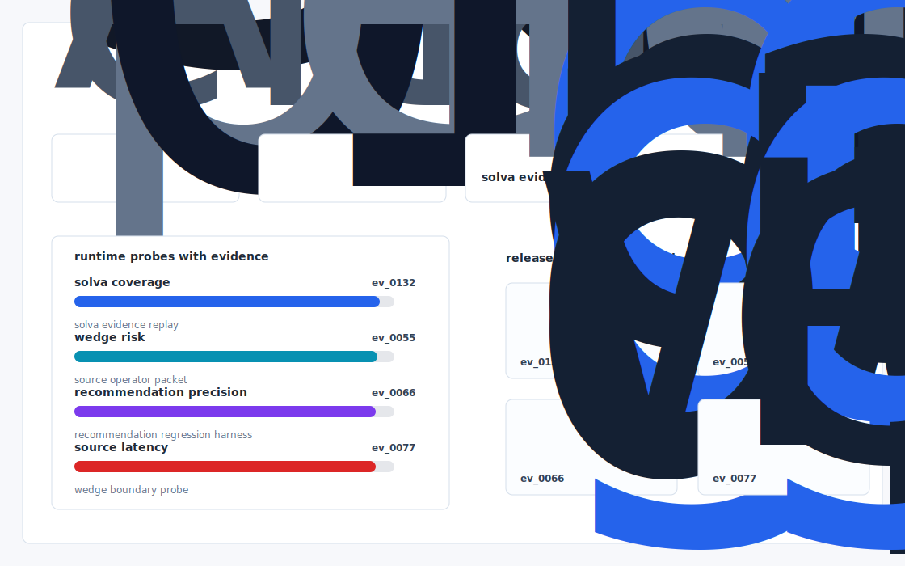
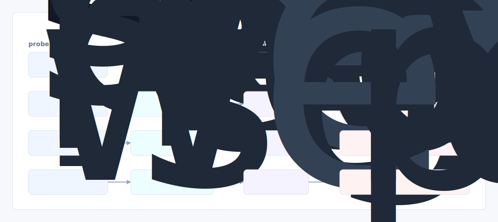

# Claims Cite

A reproducible benchmark + verification toolkit that scores any claims handling AI on citation faithfulness under adversarial document perturbations, designed to be the artifact a carrier procurement team can run before signing Solva.



## Why it exists

Solva's wedge is "every recommendation is source cited from the claim/policy documents" — i.e., they're betting that citations are the trust primitive insurers buy on. But the public artifact that proves the citations are load bearing under adversarial conditions does not exist. Concretely: when a Solva agent says "this claim violates Section 7.

The project is intentionally built as a local replay harness instead of a slide. It creates fixtures, plants realistic failure modes, produces citation-locked evidence, and turns the result into a dashboard a reviewer can inspect without credentials or hosted services.

## What is inside

- Deterministic fixture generation for the company-specific risk surface.
- Strategy code in `src/claims_cite/strategy.py` with project-specific scoring and visual evidence.
- Citation-locked reports where every decision claim points to a generated evidence ID.
- Two regenerated visual artifacts: `outputs/project_working.svg` and `outputs/evidence_map.svg`.
- A portable demo pack with JSON, CSV, Markdown, HTML, SVG, benchmark, and test artifacts.



## Signals it measures

- `solva coverage`
- `wedge risk`
- `recommendation precision`
- `source latency`

## Failure modes it plants

- solva drift
- wedge gap
- recommendation misroute
- source blindspot

## Run it locally

```bash
uv sync
uv run claims-cite all
uv run pytest -q
uv run ruff check .
```

## Outputs worth opening

- `outputs/dashboard.html`
- `outputs/project_working.svg`
- `outputs/evidence_map.svg`
- `outputs/operator_brief.md`
- `outputs/decision_report.md`
- `outputs/strategy_model.json`
- `outputs/demo_pack.zip`

## Sources

- https://www.solvatechnology.com/about-us
- https://www.ycombinator.com/companies/solva
- https://www.ycombinator.com/launches/O7o-solva-harvey-for-insurance
- https://www.ycombinator.com/companies/solva/jobs/V9X1F0T-founding-engineer
- https://www.linkedin.com/posts/y-combinator_solva-automates-insurance-claims-with-secure-activity-7358572547300364308-9L0I
- https://www.linkedin.com/in/sorenaamini/
- https://coverager.com/company/solva/
- https://huggingface.co/BAAI/bge-reranker-v2-m3
- https://huggingface.co/microsoft/deberta-v3-base-mnli

## Boundary

Everything runs locally against synthetic fixtures. There are no credentials, no customer records, no outreach files, and no hosted API dependency.
